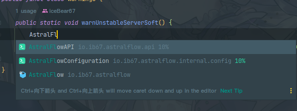

# 入门

AstralFlow 希望有更多开发者参与它的建设。

## 前置需求

在学习 AstralFlow 之前，您应该确保自己可以较为独立的：

-
    1. **编写 Java 代码。** AstralFlow 使用 Java 开发，您至少需要了解基础的 Java 开发知识。  
       *如果您正在使用像是 Kotlin, Scala 一样的在 JVM 上运行的语言，只需确保能看懂教程中的例子即可。*

-
    2. **编写 Bukkit 插件。** AstralFlow 基于 Bukkit 实现，您需要对 Bukkit API 有基本的认知。

准备就绪，那么踏上旅程！

## 导入依赖

AstralFlow 应该作为外部代码库被导入您的插件项目中，本文假设你已经准备好了一个空插件环境用于开发扩展。

### 通过主流包管理器

主流的包管理器通常支持 Maven 仓库。

1. Gradle    
   将下列代码添加到 `build.gradle` 文件里。

```groovy
repositories {
    maven {
        url "https://mvn.bukkit.rip/releases"
    }
}

dependencies {
    compileOnly group: "io.ib67", name: "astralflow", version: "0.1.0"
}
 ```

2. Maven     
   将下列代码添加到 `pom.xml` 里。

 ```xml
<repositories>
    <repository>
        <id>Bukkit.RIP Releases</id>
        <name>Bukkit.RIP</name>
        <url>https://mvn.bukkit.rip/releases</url>
    </repository>
</repositories>
```

```xml
<dependencies>
    <dependency>
        <groupId>io.ib67</groupId>
        <artifactId>astralflow</artifactId>
        <version>0.1.0</version>
    </dependency>
</dependencies>
```

> 注意：`https://mvn.bukkit.rip/releases` 即代表您使用 **正式发布版本**，若您需要使用 **预览开发版本** 请更换为 `https://mvn.bukkit.rip/snapshots`  
> 所有以 `-RC-X`, `-M-X` 结尾的版本号均为预览版本，关于版本命名请参见: [版本演进](https://github.com/saltedfishclub/documents/blob/main/Evolution.md)

### 通过 IDE 的依赖导入功能

您可以直接在 Inlined Lambdas 的仓库中下载到 AstralFlow 作为依赖，只需在 https://mvn.bukkit.rip/releases 搜寻片刻即可。  
对于如何通过 IDE 自带依赖管理功能导入，已经有类似的[文章](https://blog.csdn.net/qq_26525215/article/details/53239123)，本文不过赘述。

## 添加依赖

为了使 AstralFlow 在您的扩展加载之前运行必要的初始化工作，请将 AstralFlow 添加到依赖列表中。

```yml
depend: [ AstralFlow ]
```

接下來，尝试在 IDE 中补全 AstralFlow ，若出现 `io.ib67.astralflow.AstralFlow` 则表示成功。



# 注册扩展

为了保证正确的初始化顺序，AstralFlow 提供了专门的扩展接口。  
这些扩展接口会在 AstralFlow 的所有必要初始化工作结束后被通知，此时你可以初始化你的模块内容，例如注册物品。

## AstralExtension

首先，我们需要一个 `AstralExtension` 的子类。这是一个抽象类，他提供了一些工具方法以及代表了一个拓展对象。

```java
import io.ib67.astralflow.api.external.AstralExtension;

public final class TestModule extends AstralExtension {
  // .. 代码被省略
}
```

接着，我们需要重写构造器，传入我们的扩展信息。

```java
import io.ib67.astralflow.api.external.ExtensionInfo;

//... 代码被省略

    public TestModule() {
        super(ExtensionInfo.builder()
                .extensionAuthors(new String[]{"iceBear67"}) // 在此填入作者的名字，可空
                .extensionName("TestModule") // 扩展的名字，不可为空
                .extensionVersion("0.0.1") // 扩展的版本，不可为空
                .issueTrackerUrl("https://...") // 反馈地址，可以写 issues 也可以写联系方式
                .extensionDescription("A module for testing purposes") // 扩展描述
                .build()
        );
        registerThis(); // 将这个扩展注册到 AstralFlow 的扩展注册中心
    }

//... 代码被省略
```

除了传递必要的扩展信息，你也可以在构造器里进行材质的初始化工作。

> Builder  
> Builder 对象的每个方法都代表了一个构造参数，最终通过 `build()` 方法产生最终的对象。
>
>  在 AstralFlow 中，你可能会发现许多代码都采用了这个设计模式。  
> 得利于 Builder, 你可以避免编写过长的构造器参数并且以一种相对清晰的方式构造对象

接着，我们需要创建一个 TestModule，此处假设你在插件主类初始化时进行创建（实际上这也是推荐的做法）。

```java

public void onEnable(){
    new TestModule();
}

```

因为我们已经在 `TestModule` 的构造器中写了 `registerThis();` ，因此不需要再用更多代码把他注册到 AstralFlow 里，他已经自己注册了。

在[下一章](getting_started/jeb_wool.md)，我们将会通过编写一个自动变色的羊毛来熟悉一下 AstralFlow 中的常用组件。  