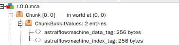

# 区块存储格式 (v1)

AstralFlow 将机器的数据储存在区块内，这是通过 Bukkit 的 `PersistentDataContainer` 实现的。

- 对于 NBT 视图，他储存在 `ChunkBukkitValues.{namespace and key}` 中

# 索引

AstralFlow 采用索引记录每个机器的位置和数目，并在 `数目 == 0` 时跳过加载过程。

索引以 NBT ByteArray 的形式储存在 `ChunkBukkitValues.astralflow:machine_index_tag` 中。  
在 AstralFlow
中的实现为 [MachineIndexTag](https://github.com/InlinedLambdas/AstralFlow/blob/main/src/main/java/io/ib67/astralflow/internal/storage/impl/chunk/tag/MachineIndexTag.java)

## 数据格式

主体的数据主要由六个部分组成。

1. `version` *byte 1 byte* - 数据版本，用于自动迁移和检查有效性。当前为 `1`
2. `chunkX` *int 4 bytes* - 区块的 X 坐标
3. `chunkZ` *int 4 bytes* - 区块的 Z 坐标
4. `hasMachine` *boolean 1 byte* - 是否有机器
5. `machineCount` *int 4 bytes* - 机器数量
6. `machineEntries` *entries ?? bytes* - 机器列表

每一个 `machineEntries` 都是定长的，所以可以使用 `machineCount` 次循环来读出所有的机器。

### machineEntries

机器列表由以下部分组成：

1`cpool` *constant pool ?? bytes* - 常量池
2`machines` *machineList ?? bytes* - 真正的机器列表

### cpool

常量池里存放了机器列表中所有的机器类型，以此在 `machines` 中用对应的索引来表示类型。

1. `cpoolSize` *int 4 bytes* - 常量数目
2. `cpool` *constant pool ?? bytes* - 常量池

对于 `cpool` 的每个元素:

1. `len` *short 2 byte* - 元素的长度
2. `data` *byte[] ?? bytes* - 元素的数据(总是文本)，UTF-8

### machines

此处存放了机器的类型信息和位置。

对于每一个元素:

1. `type` *int 4 bytes* - 常量池索引，指向一个 String.
2. `location` *location ?? bytes* - 具体的位置

### location

代表一个 `org.bukkit.Location` 的数据，由以下部分组成:

1. `worldNameLen` *byte 1 bytes* - 世界名的长度
2. `worldName` *byte[] worldNameLen bytes* - 世界名
3. `x` *byte 1 bytes* - X 坐标，区块内的相对坐标
4. `y` *int 4 bytes* - Y 坐标
5. `z` *byte 1 bytes* - Z 坐标，区块内的相对坐标

# 机器数据

机器数据以 NBT ByteArray 的形式储存在 `ChunkBukkitValues.astralflow:machine_data_tag` 中。  
在 AstralFlow
中的实现为 [MachineDataTag](https://github.com/InlinedLambdas/AstralFlow/blob/main/src/main/java/io/ib67/astralflow/internal/storage/impl/chunk/tag/MachineDataTag.java)

## 数据格式

1. `version` *byte 1 bytes* - 数据的版本号，用于自动迁移和检查有效性。当前为 `0`
2. `chunkX` *int 4 bytes* - 区块的 X 坐标
3. `chunkZ` *int 4 bytes* - 区块的 Z 坐标
4. `machineCount` *int 4 bytes* - 机器数量
5. `machineData` *byte[] ??? bytes* - 机器数据列表

## machineData

对于每一个元素:

1. `location` *location ?? bytes* - 机器的位置，定义同上
2. `type` *byte 1 bytes* - 数据的储存类型，决定 AstralFlow 如何序列化这些数据  
   关于可选的类型，参考 [MachineStorageType](https://github.com/InlinedLambdas/AstralFlow/blob/main/src/main/java/io/ib67/astralflow/internal/storage/impl/MachineStorageType.java)
3. `len` *int 4 bytes* - 数据长度
4. `data` *byte[] len bytes* - 数据
